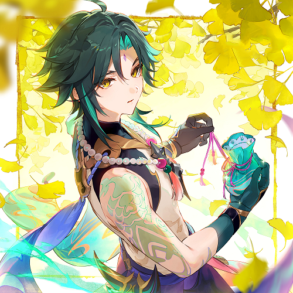
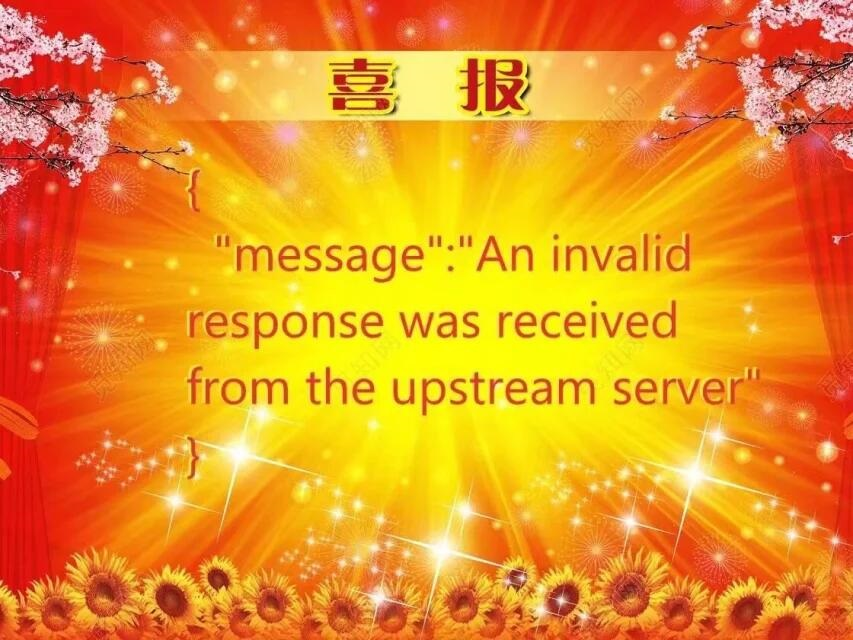
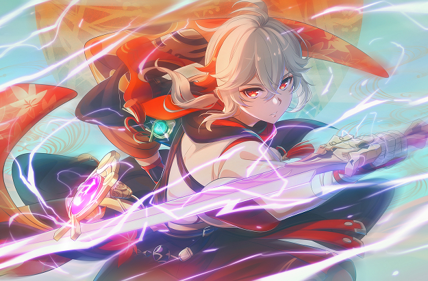

# BMPMultiSteg 简介


一个基于LSB（最低有效位）技术的BMP图片隐写工具，可以将任意文件写入一个或多个BMP图片文件中。

A tool that can steganographically embed one file into one or multiple BMP images using the LSB (Least Significant Bit). Full English documentation is [here](#bmpmultisteg-english-documentation)

## 使用方法

### 安装

直接在[Releases](https://github.com/gfdfdxc/BMPMultiSteg/releases)下载由GitHub编译的二进制文件即可。此项目目前只支持Windows系统。

### 使用

打开软件选择工作目录，工作目录中应该包含待隐写的图片，隐写后的图片会在保存在`./steg`文件夹中

提取文件时需要把工作目录切换到包含隐写后的图片的文件夹，如成功提取将会在当前目录生成`extracted.bin`

## Demo

### Steg

| Carrier1            | Carrier2                                                     | Data                                                         |
| ------------------- | ------------------------------------------------------------ | ------------------------------------------------------------ |
|  |  |  |

| Result1             | Result2             |
| ------------------- | ------------------- |
|  |  |

### Extract

```text
+================+
|    Selecting   |
+================+

        Note: You can select any file with the same CRC32 value.
        Index: 0, CRC32: 0x2F2874B5
        Index: 1, CRC32: 0x2F2874B5

<Enter>Select <Ctrl-C>Exit
Now I will get 78656 bytes from 1.bmp
Now I will get 78656 bytes from 2.bmp
CRC32 Check Passed.
Success!
Working Folder: 
<Your Working Folder>

<1>File Info <2>Steg <3>Extract <4>Change Working Dir <Ctrl-C>Exit
```

| extracted.bin                    |
| -------------------------------- |
|  |

### Info

```text
+================+
|File/Folder Info|
+================+

        1.bmp
        2.bmp

<Enter>View file info <Esc>Exit
You selected 0, name: 1.bmp
BMP Header Information:
Width: 1250 pixels
Height: 822 pixels
Bit Count: 24
Image Size: 3084198 bytes
Now I will get 32 bytes from 1.bmp

======Steg Header Information======
Software Version: 1.0
Encrypt flag (Not enabled): 0
ALL BMP number of this steged file: 2
The file index of this series: 1
The full steged file is: 157248 Bytes
The steged data in this file is: 78624 Bytes
The CRC32 checksum of steged file is: 0x2F2874B5
Success!
Working Folder:
<Your Working Folder>

<1>File Info <2>Steg <3>Extract <4>Change Working Dir <Ctrl-C>Exit
```

## 说明

课设项目，基本功能已测试过无明显bug。软件工作路径不能为中文或其他非ASCII文本。

有时候切换工作目录的时候会有可能失败，你可以通过重开软件来解决。

喜欢的话可以点一个star！谢谢你的鼓励（给心心

## 致谢

感谢https://github.com/DimitarPetrov/stegify/blob/master/README.md 提供了文档格式参考

感谢https://github.com/marc-q/libbmp 提供了BMP读写库

感谢https://github.com/cristianadam/HelloWorld 提供了自动编译Action

感谢https://weibo.com/u/3735856601 与 https://twitter.com/DSmile9 提供了两张Carrier图片

## 协议

本项目使用了`AGPL-3.0 license`

Copyright ©gfdfdxc 2023

# BMPMultiSteg English Documentation
A tool that can steganographically embed one file into one or multiple BMP images using the LSB (Least Significant Bit).

## Usage

### Installation

Just download the binaries compiled by GitHub directly from [Releases](https://github.com/gfdfdxc/BMPMultiSteg/releases). This project currently only supports Windows.

### How to use

Open the software and select the working directory, the working directory should contain the image to be steganographed, the steganographed image will be saved in the `./steg` folder.

When extracting the file, you need to switch the working directory to the folder that contains the steganographic image, if the extraction is successful, it will generate `extracted.bin` in the current directory.

## Demo

Please goto [Demo](#demo)

## Description

This is a course project, the basic function has been tested without obvious bugs, the working path of the software can not be Chinese or other non-ASCII characters.

Sometimes switching the working directory may fail, you can solve the problem by reopening the software.

If you like it, you can give me a star, thank you for your encouragement!

## Acknowledgments

Thanks to https://github.com/DimitarPetrov/stegify/blob/master/README.md for providing the document format reference.

Thanks to https://github.com/marc-q/libbmp for providing the BMP library.

Thanks to https://github.com/cristianadam/HelloWorld for providing auto compile action

Thanks to https://weibo.com/u/3735856601 and https://twitter.com/DSmile9 for the two Carrier images.

## LICENSE

This project uses the `AGPL-3.0 license`.

Copyright ©gfdfdxc 2023